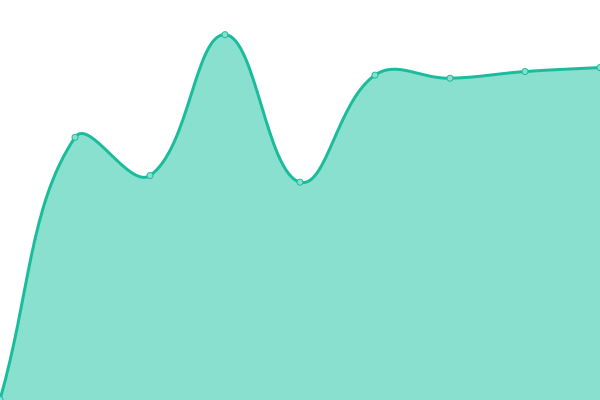

# [📈 Live Status](https://jonasled.github.io): <!--live status--> **🟧 Partial outage**

This repository contains the open-source uptime monitor and status page for [Jonas Leder](https://jonasled.de), powered by [Upptime](https://github.com/upptime/upptime).

With [Upptime](https://upptime.js.org), you can get your own unlimited and free uptime monitor and status page, powered entirely by a GitHub repository. We use [Issues](https://github.com/jonasled/status/issues) as incident reports, [Actions](https://github.com/jonasled/status/actions) as uptime monitors, and [Pages](https://jonasled.github.io) for the status page.

<!--start: status pages-->
<!-- This summary is generated by Upptime (https://github.com/upptime/upptime) -->
<!-- Do not edit this manually, your changes will be overwritten -->
<!-- prettier-ignore -->
| URL | Status | History | Response Time | Uptime |
| --- | ------ | ------- | ------------- | ------ |
|  [URL Shorter](https://jle.xyz) | 🟥 Down | [url-shorter.yml](https://github.com/jonasled/status/commits/HEAD/history/url-shorter.yml) | 

 3516ms
     
 | 

<a href="https://status.jonasled.de/history/url-shorter">80.11%</a>
    

|  [Website](https://jonasled.de) | 🟥 Down | [website.yml](https://github.com/jonasled/status/commits/HEAD/history/website.yml) | 

 3537ms
     
 | 

<a href="https://status.jonasled.de/history/website">82.00%</a>
    

|  [Hastebin](https://paste.jonasled.de) | 🟥 Down | [hastebin.yml](https://github.com/jonasled/status/commits/HEAD/history/hastebin.yml) | 

 4355ms
     
 | 

<a href="https://status.jonasled.de/history/hastebin">79.90%</a>
    

|  [Nextcloud](https://nextcloud.jonasled.de) | 🟥 Down | [nextcloud.yml](https://github.com/jonasled/status/commits/HEAD/history/nextcloud.yml) | 

 5213ms
     
 | 

<a href="https://status.jonasled.de/history/nextcloud">79.82%</a>
    

|  [Proxmox](https://pve.jonasled.de) | 🟩 Up | [proxmox.yml](https://github.com/jonasled/status/commits/HEAD/history/proxmox.yml) | 

 2781ms
     
 | 

<a href="https://status.jonasled.de/history/proxmox">82.28%</a>
    

|  [Matrix](https://matrix.jonasled.de/_matrix/federation/v1/version) | 🟩 Up | [matrix.yml](https://github.com/jonasled/status/commits/HEAD/history/matrix.yml) | 

 1806ms
     
 | 

<a href="https://status.jonasled.de/history/matrix">82.05%</a>
    

|  [APT-Mirror](https://apt.jonasled.de) | 🟩 Up | [apt-mirror.yml](https://github.com/jonasled/status/commits/HEAD/history/apt-mirror.yml) | 

 2301ms
     
 | 

<a href="https://status.jonasled.de/history/apt-mirror">82.16%</a>
    

|  [Alpine-mirror](https://alpine.jonasled.de) | 🟩 Up | [alpine-mirror.yml](https://github.com/jonasled/status/commits/HEAD/history/alpine-mirror.yml) | 

 3176ms
     
 | 

<a href="https://status.jonasled.de/history/alpine-mirror">82.25%</a>
    

|  [Gitlab](https://gitlab.jonasled.de) | 🟩 Up | [gitlab.yml](https://github.com/jonasled/status/commits/HEAD/history/gitlab.yml) | 

 2320ms
     
 | 

<a href="https://status.jonasled.de/history/gitlab">82.14%</a>
    

|  [Cyber Panel](https://cp.jonasled.de) | 🟩 Up | [cyber-panel.yml](https://github.com/jonasled/status/commits/HEAD/history/cyber-panel.yml) | 

 4289ms
     
 | 

<a href="https://status.jonasled.de/history/cyber-panel">82.46%</a>
    

|  [Mailcow](https://mailcow.jonasled.de) | 🟩 Up | [mailcow.yml](https://github.com/jonasled/status/commits/HEAD/history/mailcow.yml) | 

 1733ms
     
 | 

<a href="https://status.jonasled.de/history/mailcow">82.30%</a>
    

|  [Proxmox Mail Gateway](https://pmg.jonasled.de) | 🟥 Down | [proxmox-mail-gateway.yml](https://github.com/jonasled/status/commits/HEAD/history/proxmox-mail-gateway.yml) | 

 652ms
     
 | 

<a href="https://status.jonasled.de/history/proxmox-mail-gateway">58.61%</a>
    

|  [Proxmox Mail Gateway 2](https://pmg2.jonasled.de:8006) | 🟩 Up | [proxmox-mail-gateway-2.yml](https://github.com/jonasled/status/commits/HEAD/history/proxmox-mail-gateway-2.yml) | 

 712ms
     
 | 

<a href="https://status.jonasled.de/history/proxmox-mail-gateway-2">100.00%</a>
    

|  [Minio S3 Server](https://s3.jonasled.de/share/) | 🟩 Up | [minio-s3-server.yml](https://github.com/jonasled/status/commits/HEAD/history/minio-s3-server.yml) | 

 2343ms
     
 | 

<a href="https://status.jonasled.de/history/minio-s3-server">82.30%</a>
    

|  [Gameserver Node](https://1.game.jonasled.de:8444/) | 🟩 Up | [gameserver-node.yml](https://github.com/jonasled/status/commits/HEAD/history/gameserver-node.yml) | 

 2403ms
     
 | 

<a href="https://status.jonasled.de/history/gameserver-node">82.55%</a>
    

<!--end: status pages-->

[**Visit our status website →**](https://jonasled.github.io)

## 📄 License

- Powered by: [Upptime](https://github.com/upptime/upptime)
- Code: [MIT](./LICENSE) © [Jonas Leder](https://jonasled.de)
- Data in the `./history` directory: [Open Database License](https://opendatacommons.org/licenses/odbl/1-0/)
